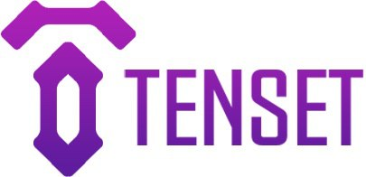

# TechGen DAO Token smart contract

* _Standart_        : [ERC20](https://github.com/ethereum/EIPs/blob/master/EIPS/eip-20.md)
* _[Name](https://github.com/ethereum/EIPs/blob/master/EIPS/eip-20.md#name)_            : TechGen DAO Token
* _[Ticker](https://github.com/ethereum/EIPs/blob/master/EIPS/eip-20.md#symbol)_        : TGDao
* _[Decimals](https://github.com/ethereum/EIPs/blob/master/EIPS/eip-20.md#decimals)_    : 18
* _Emission_        : Single, 30 000 000 tokens
* _Fiat dependency_ : No
* _Token offers_    : 2
* _Token locks_     : Yes

## Smart-contracts description

TechGen DAO Token smart-contract

### Contracts:
1. _TechGenDAOToken_  - Token contract
2. _CommonSale_       - Sale contract 
3. _FreezeWallet_     - A wallet for frozen team tokens. The total freezing period is 30 months. Every 3 months, 10% of the initial amount is unfrozen and transferred to the Team's wallet.
4. _Configurator_     - 

### Contract features

### Whitelist
1. Private sale have a whitelist

### Private sale customers checked specially
To provide differenece between private and public sales customers contract have special array.
It needs to send this information to TecnGen platform for futher actions.

### How to manage contract
To start working with the contract you should follow theese steps:
1. Compile the conttract using Remix with `enamble optimization` flag and compiler version set to 0.6.2
2. Deploy the contract using Remix + MetaMask. Set Gas limit to 7,000,000 (actually 6,433,413).

### Wallets with ERC20 support
1. [MyEtherWallet](https://www.myetherwallet.com)
2. Parity 
3. Mist/Ethereum wallet

EXODUS does not support ERC20, but provides the ability to export the private key to MyEtherWallet - http://support.exodus.io/article/128-how-do-i-receive-unsupported-erc20-tokens

## Main network configuration 

### Token distribution
1. Reserve      (15%)               :  4,500,000 Tokens
2. Team         (10%)               : 21,000,000 Tokens, The total freezing period is 2 years. Every months after 1 year, 7% of the initial amount will be unfrozen and ready for withdrawal
3. Liqudity     (10%)               :  3,000,000 Tokens 
3. Marketing    (30%)               :  9,000,000 Tokens 
3. Private Sale (15%)               :  4,500,000 Tokens, 6 month lock 
3. Public Sale  (15%)               :  4,500,000 Tokens, 3 month lock 

### Sale stages

* price                             : 0,0000125 ETH per Token

#### Private Sale
* Maximum purchase volume           : 0.000625 ETH
* HardCap                           : 4,500,000 Tokens
* Start date                        : 31/01/2021 (7pm GMT+1 time) (ethereum timestamp: 1612072800)
* End date                          : 07/02/2021 (7pm GMT+1 time) (ethereum timestamp: 1612677600)
* Freeze                            : 6 month

#### Public Sale
* Maximum purchase volume           : 0.000625 ETH
* HardCap                           : 4,500,000 Tokens
* Start date                        : 07/03/2021 (7pm GMT+1 time) (ethereum timestamp: 1612677600)
* End date                          : 14/03/2021 (7pm GMT+1 time) (ethereum timestamp: 1613282400)
* Freeze                            : 3 month

### Links 
1. _TechGenDAOToken_ contract       : [0x0000000000000000000000000000000000000000](https://etherscan.io/token/0x0000000000000000000000000000000000000000)
2. _Private sale_ contract          : [0x0000000000000000000000000000000000000000](https://etherscan.io/address/0x0000000000000000000000000000000000000000)
2. _Public sale_ contract           : [0x0000000000000000000000000000000000000000](https://etherscan.io/address/0x0000000000000000000000000000000000000000)
3. _Team wallet_ contract           : [0x0000000000000000000000000000000000000000](https://etherscan.io/address/0x0000000000000000000000000000000000000000)
4. _Configurator_ contract          : [0x0000000000000000000000000000000000000000](https://etherscan.io/address/0x0000000000000000000000000000000000000000)
5. ETH wallet address               : [0x0000000000000000000000000000000000000000](https://etherscan.io/address/0x0000000000000000000000000000000000000000)
5. Reserv wallet address            : [0x0000000000000000000000000000000000000000](https://etherscan.io/address/0x0000000000000000000000000000000000000000)
8. Marketig wallet address          : [0x0000000000000000000000000000000000000000](https://etherscan.io/address/0x0000000000000000000000000000000000000000)
6. Team contract owner address      : [0x0000000000000000000000000000000000000000](https://etherscan.io/address/0x0000000000000000000000000000000000000000)
9. Liquidity wallet  address        : [0x0000000000000000000000000000000000000000](https://etherscan.io/address/0x0000000000000000000000000000000000000000)
10. Admin wallet address            : [0x0000000000000000000000000000000000000000](https://etherscan.io/address/0x0000000000000000000000000000000000000000)

